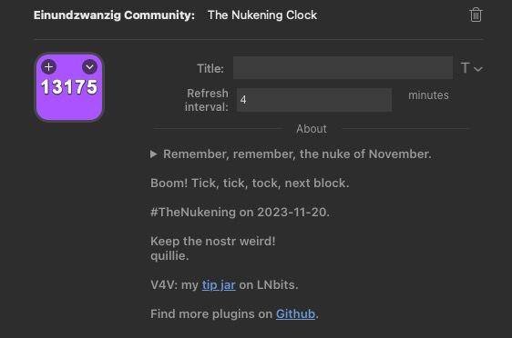
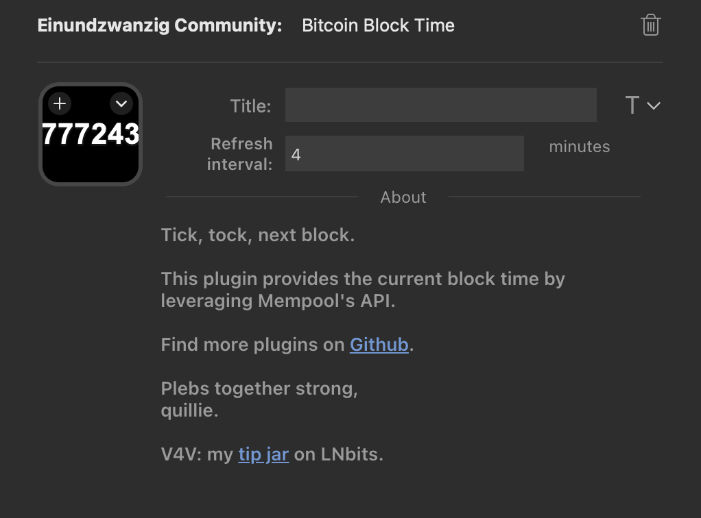

# Bitcoin Plugins for Elgato Stream Decks

## What is a Stream Deck?

> A stream deck is piece of hardware that boasts a set of physical keys that can be customized to perform various functions. The device plugs into your computer, usually via USB, and once dedicated software is loaded onto it, allows you to program all of the buttons to execute whatever commands you like. A large majority feature LCD keys which conveniently eliminates the need to memorize the shortcuts you’ve set for each key.

Learn more about Streamdecks on [maketecheasier](https://www.maketecheasier.com/what-is-stream-deck/).

## What Bitcoin-related plugins do we provide?

This project contains a collection of useful plugins for Elgato Stream Decks that leverage Mempool's API. Available plugins:

- [Block Time Plugin](https://github.com/quilloughbee/streamdeck-bitcoin-plugins/raw/main/release/com.quillie.blocktime.streamDeckPlugin) 
- [Moscow Time Plugin](https://github.com/quilloughbee/streamdeck-bitcoin-plugins/raw/main/release/com.quillie.moscowtime.streamDeckPlugin)
- [The Nukening Plugin](https://github.com/quilloughbee/streamdeck-bitcoin-plugins/raw/main/release/com.quillie.nukening.streamDeckPlugin) 
- [Einundzwanzig Plugin](https://github.com/quilloughbee/streamdeck-bitcoin-plugins/raw/main/release/com.quillie.einundzwanzig.streamDeckPlugin)
- [Transaction Backlog Plugin](https://github.com/quilloughbee/streamdeck-bitcoin-plugins/raw/main/release/com.quillie.backlog.streamDeckPlugin)
- [Transaction Fee Recommender Plugin](https://github.com/quilloughbee/streamdeck-bitcoin-plugins/raw/main/release/com.quillie.fees.streamDeckPlugin)

Download the packaged plugins from the release folder **or** click one of the links above. Having downloaded the plugins, run installation via double-click. Elgato's software will guide you through the process.

Made by toxic Bitcoin Maximalists 🧡

## The Nukening Clock

While block time can be defined in various ways, most Bitcoin plebs have the current height of the Bitcoin blockchain in mind (see [block time](https://www.blocktime.live/)). 

The Nukening plugin displays the number of Bitcoin bocks since the [Damus nukening](https://njump.me/nevent1qqsz2jet77rmatz6hp8vflr80uhqn02gzk4x0a50a34np8m8kcqfhnqpz3mhxue69uhhyetvv9ujuerpd46hxtnfduqs6amnwvaz7tmwdaejumr0dsq3jamnwvaz7tmsv93xcmmxxaazumn0wd68yvfwvdhk6qg4waehxw309aex2mrp0yhxummnw3ezumn9wsu7pehr). 

## Block Time 

While block time can be defined in various ways, most Bitcoin plebs have the current height of the Bitcoin blockchain in mind (see [block time](https://www.blocktime.live/)). 

The Block Time plugin displays the current block height by querying Mempool.space

## Moscow Time 

What the hell is Moscow Time?

> Moscow Time is a Bitcoin meme inadvertently spawned by cybersecurity researcher Chris Vickery in March...
Moscow Time counts down as Bitcoin’s price increases. - [Protos](https://protos.com/bitcoin-clock-moscow-time-jack-dorsey-blockclock-memes/)

Moscow Time has become a common thing to mention in podcasts and live streams. It goes without saying that in view of a likely Hyperbitcoinization, we definitely saw the need for a plugin.

## Einundzwanzig Portal Shortcut

The Einundzwanzig plugin can be seen as a tribute to the [Einundzwanzig podcast](https://einundzwanzig.space/), the leading Bitcoin community podcast in German-speaking Europe. The plugin will display the Einundzwanzig logo and open the podcast's community portal upon pressing the button.

## Transaction Fee Recommender

Setting a transaction fee can be a difficult thing to do in times of ordinals flooding the mempool. Hence, the Transaction Fee plugin recommends, depending on the selected priority, the amount of sats per vbyte you should set.

## Transaction Backlog

To get an idea of what's going on in the mempool, the transaction backlog plugin displays the number of unconfirmed transactions waiting in the mempool.

## Acknowledgements

This project relies on:

- [Mempool API](https://mempool.space/docs/faq#what-is-a-mempool)
- [EasyPI v1.3 by BarRaider](https://github.com/BarRaider/streamdeck-easypi). Support BarRaider via [PayPal](https://www.paypal.com/paypalme/BarRaider)
- This project has been inspired by the [BTC Ticker](https://apps.elgato.com/plugins/com.dahnandpartners.btcticker) published by Dahn and Partners

## Feedback

Got an idea for further plugins? Discovered a bug? Feel free to open an issue right here on Github.

## Value 4 Value

In case you enjoy using these Bitcoin plugins, we'd be happy to see a few sats at the [>>TIP JAR<<](https://legend.lnbits.com/tipjar/736) or via [quillie@getalby.com](). 

Plebs together strong   -   last update at [830878](https://mempool.space/block/830878).
